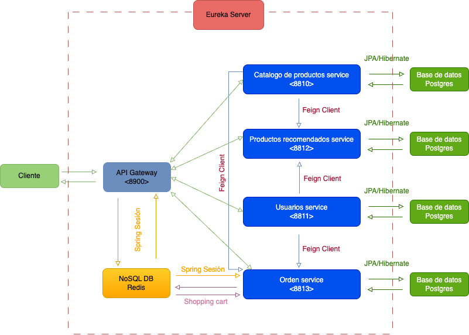

Proyecto ecommerce para bootcamp Keycode

Este proyecto se hace para reflejar los conocimientos adquiridos en este bootcamp y con la proyección de demostración personal sobre lo aprendido en lenguaje JAVA.

El proyecto lo hará Wilmer Alfredo Galeano Rodríguez de manera solitaria con versionamiento de código y flujo de trabajo GitFlow. El entregable será desde el enlace de github que genere una vez subido todo el proyecto.

Este proyecto lo propongo a manera de reto personal porque he trabajado con shopify y woocomerce en el frontend y la idea es entender más sobre este tema desde el lado del backend. Además quiero construir una tienda funcional desde el lado del servidor para escalar propuestas a futuros clientes o para servir de alternativa a la agencia donde trabajo.

De acuerdo a los requerimientos del proyecto usaré los siguientes:

    1. Trabajar la versión 2.7 de Spring Boot con la versión de JAVA 17.
    2. Será enteramente de microservicios, no llevara spring web.
    3. El motor de base de datos elegido es postgresql.
    4. Se implementará Docker.
    5. Se documentará los endpoints con JavaDoc.
    6. Se realizará un diagrama que demostrará la arquitectura de los microservicios.
    7. Se crearán a roles y permisos a:
        a) Administrador
        b) Usuarios
    8. Implementar módulos de seguridad y autorizaciones con JWT a:
        a) Administrador
        b) Usuarios
    9. Usar Redis Cache como la tecnología que el docente Carlos indicó para trabajar en la parte del carrito de compras.
    10. El proyecto tendrá Productos, Colecciones, Carrito de compras, Checkout para recolectar información de las compras realizadas, inicios de sesión desde los roles Administrador y Empleados con sus respectivas limitaciones que se les llegue a asignar.
    11. Se agregarán Pruebas unitarias y Pruebas de integración.
    12. Se cumplirá con la cobertura del código mayor o igual al 80%.

